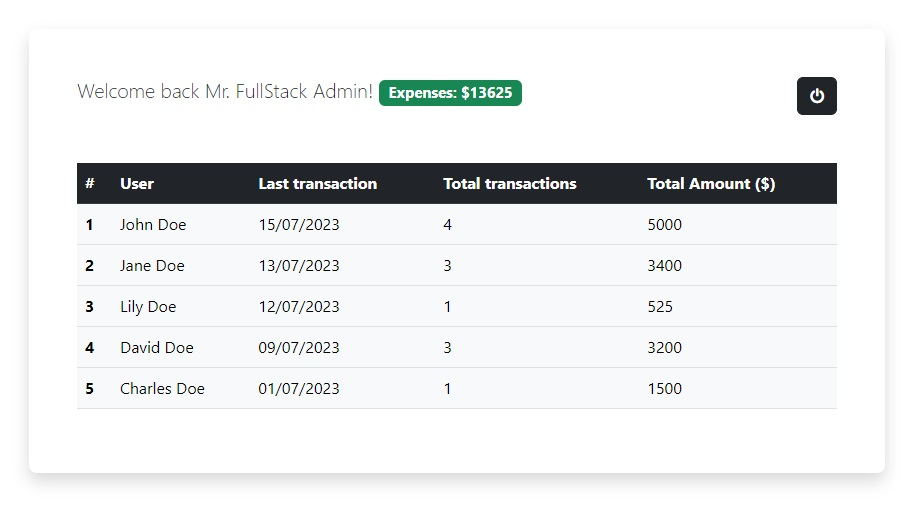
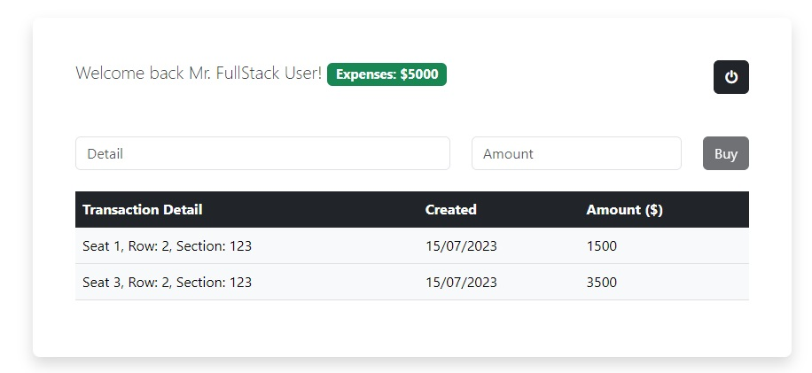

## Descarga e instalación de Node.js y npm

https://docs.npmjs.com/downloading-and-installing-node-js-and-npm

## Instalación y arranque

cd ./app

npm install

npm run start

## Descripción de la prueba

Dado un portal de emergencia con la estructura base de componentes y servcios, se deben de implementar las llamadas a la API.
El portal debe implementar el login contra la API y gestionar la sesión:
Por un lado dependiendo del tipo de usuario si es `admin` o `customer` el portal cargará una ruta u otra:

- admin : `http://localhost:4200/admin`
- customer : `http://localhost:4200/user`

**Vista del administrador:**

- Listar todos los usuarios en una tabla, ver el sumatorio del campo 'amount' de las transacciones de cada usuario, la fecha de la última transacción y total de transacciones de ese usuario.
- El formato de la fecha debe ser friendly para el usuario (27/07/2023).
- La tabla contendrá 4 columnas: 'ID', 'User', 'Last transaction', 'Total transactions', 'Total Amount'

**Ejemplo**

**Vista del usuario:**

- Listar todas sus transacciones en una tabla con las columnas: 'detail', 'amount', 'created'.
- La fecha del campo 'created' se mostrará en un formato friendly para el usuario (27/07/2023).
- Visualizar fuera de la tabla el sumatorio del campo 'amount' de todas sus transaccones.
- Incluir un formulario con 2 campos encima de la tabla: 'Amount' y 'Details' que deberán mandarse a la API para que guarde la transacción.
- La lista y el apartado del sumatorio se refrescará al completarse la transacción.

**Ejemplo de diseño**

## Documentación recomendada:

Angular : https://angular.io/docs

## Librerias externas ya incluidas en el proyecto

Bootstrap 5: https://getbootstrap.com/docs/5.3/getting-started/introduction/

Font Awesome 4: https://fontawesome.com/v4/icons/

## Que valoramos en esta prueba

Se valorará la calidad técnica junto a la capacidad autoresolutiva y de lectura de documentación para implementar las siguientes dificultades:

- Implementar los servicios necesarios para hacer las llamadas a la API
- Implementación de resolvers en las rutas para llamar a la API antes que cargue el componente
- Implementación del servicio de login y como gestionas de la sesión.
- Uso de interceptores para inclur el bearer token en las llamadas a la API
